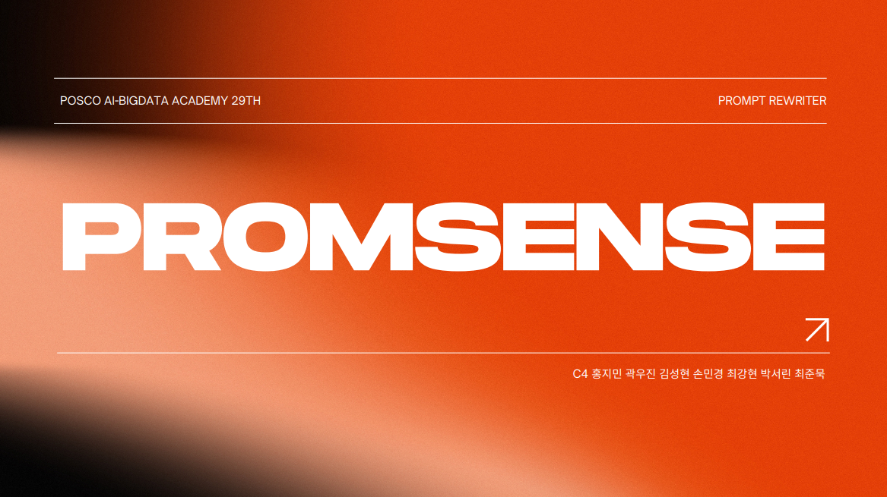
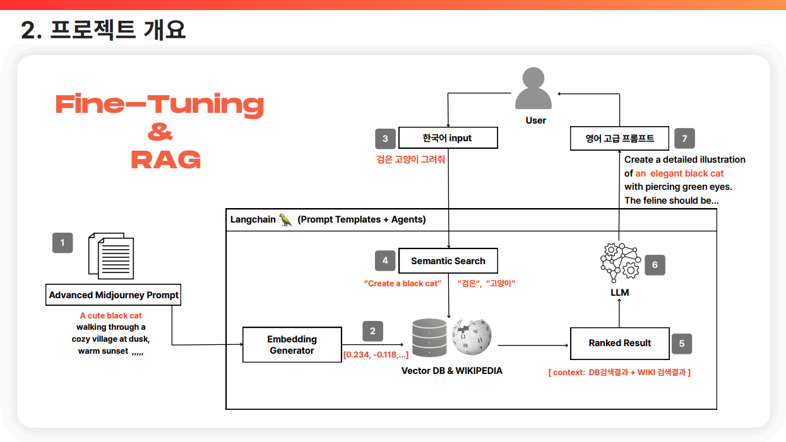

# PromSense



**PromSense**는 한국어 사용자도 손쉽게 고품질 AI 이미지 생성 프롬프트를 만들 수 있도록 설계된 **대화형 웹 애플리케이션**입니다.
영어 프롬프트만을 허용하는 Midjourney와 같은 AI 이미지 생성 도구의 진입 장벽을 낮추기 위해,
한국어 입력을 **이미지 생성에 최적화된 영어 프롬프트로 변환**하는 것을 목표로 합니다.

본 프로젝트는 **카나나(Kanana) 데이터셋을 기반으로 파인튜닝된 SLLM(Structured Language Model)**을 활용하여
구조화되고 품질 높은 이미지 생성 프롬프트를 자동 생성하는 서비스입니다.

현재는 **웹 인터페이스 및 대화 저장 기능까지 구현 완료**되었으며,
AI 모델 연동은 추후 단계로 예정되어 있습니다.

* Live Site: [https://www.promsense.com](https://www.promsense.com)
* [프로젝트 최종 보고서 (PDF)](docs/C4_promsense_최종.pdf)

---

## 주요 기능

* 한국어 입력 기반 이미지 프롬프트 생성 (모델 연동 예정)
* ChatGPT 스타일의 대화형 인터페이스
* 이전 대화 히스토리 저장 및 이어쓰기 기능
* 웹 브라우저 기반 반응형 UI
* 카나나 데이터셋 기반 SLLM 파인튜닝 완료
* Midjourney, DALL·E 등 외부 이미지 생성기 연동 예정

---

## 사용 예시

입력 (한국어)

```
우주에서 떠다니는 고양이, 초현실적인 느낌으로
```

예정 출력 (영어 프롬프트)

```
A hyper-realistic surrealistic image of a cat floating in cosmic space,
cinematic lighting, ultra-detailed, 8K render
```

---

## 기술 스택

| 구분       | 기술                                  |
| -------- | ----------------------------------- |
| Backend  | Python, Django                      |
| Frontend | HTML, CSS, JavaScript               |
| Template | Django Template Language (DTL)      |
| UI       | ChatGPT 스타일 커스텀 대화 UI               |
| AI Model | SLLM (Fine-tuned on Kanana Dataset) |

---

## 프로젝트 아키텍처

### Fine-Tuning & RAG 시스템 개요

본 프로젝트는 **Fine-Tuning**과 **RAG(Retrieval-Augmented Generation)** 구조를 결합하여
이미지 생성에 최적화된 프롬프트를 생성합니다.



1. Advanced Midjourney Prompt 데이터셋 기반 파인튜닝
2. Embedding Generator를 활용한 벡터 데이터베이스 구축 (Wikipedia 연동)
3. 사용자 한국어 입력에 대한 Semantic Search 수행
4. LangChain (Prompt Template, Agent)을 활용한 컨텍스트 증강
5. LLM을 통한 고품질 영어 프롬프트 생성

---

## 상세 문서

프로젝트의 전체 설계, 모델 구조, 데이터셋 구성 및 실험 결과는
아래 최종 보고서에서 확인할 수 있습니다.

* [프로젝트 최종 보고서 (PDF)](docs/C4_promsense_최종.pdf)
